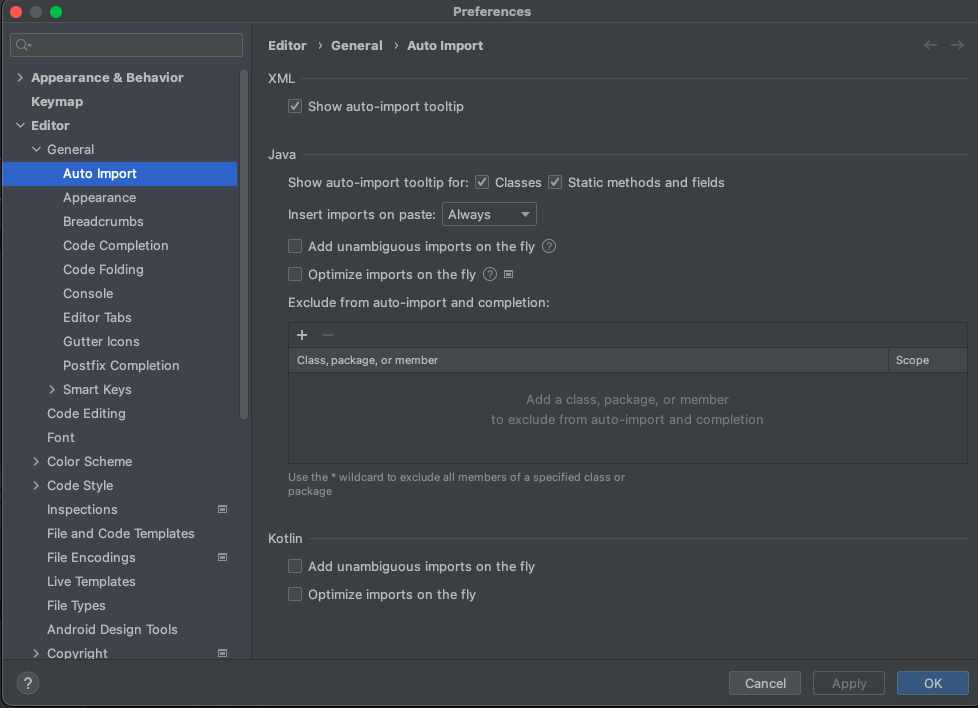
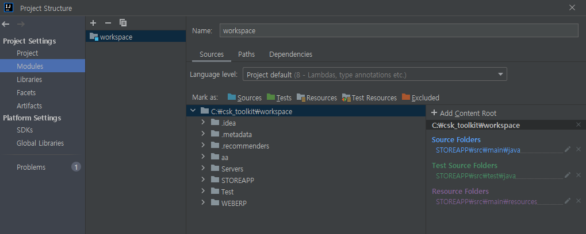
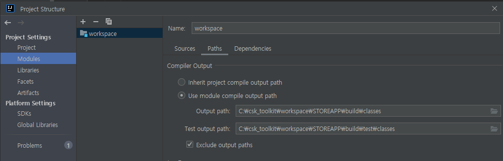
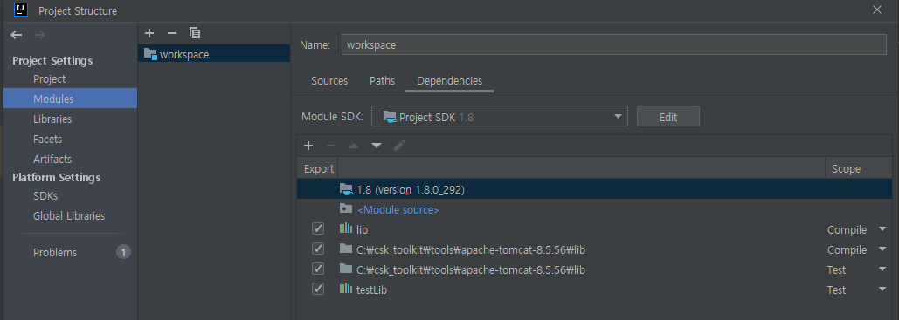
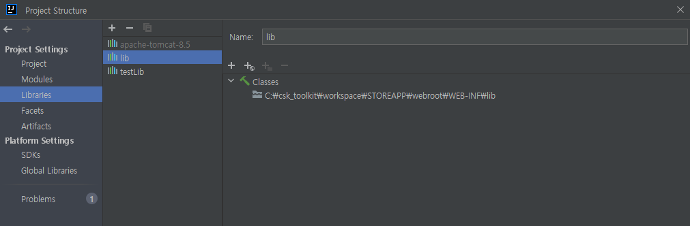
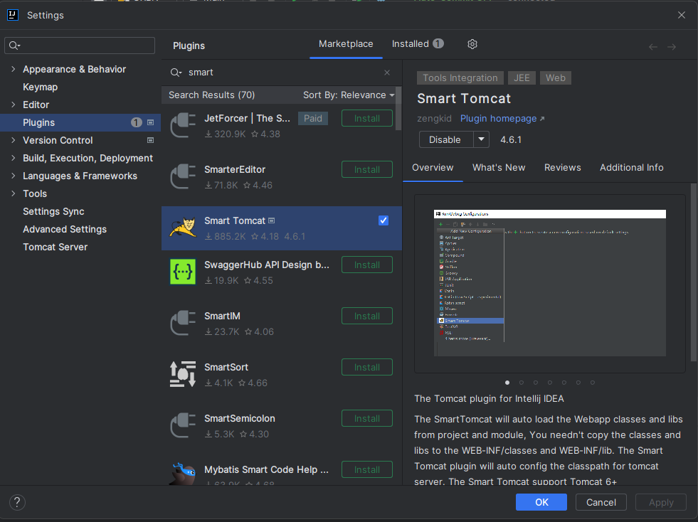
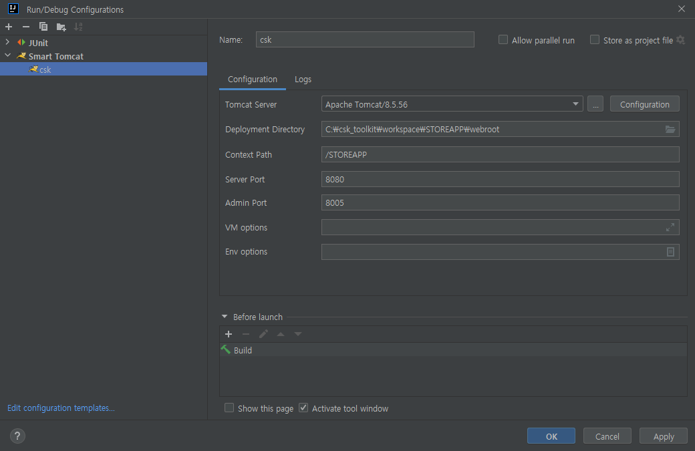

# 인텔리제이

- 단축키 링크
    - [https://blog.jetbrains.com/ko/idea/2022/11/top-underrated-shortcuts/](https://secondmemory.kr/567)
    - [https://secondmemory.kr/567](https://secondmemory.kr/567)
    - [https://ifuwanna.tistory.com/241](https://ifuwanna.tistory.com/241)

- 맥북 h2 설정
    - [https://freestrokes.tistory.com/109](https://freestrokes.tistory.com/109)
    - [https://dev-j.tistory.com/10](https://dev-j.tistory.com/10)
    
- homebrew 설치
    - [https://shanepark.tistory.com/45](https://shanepark.tistory.com/45)
    - [https://jin2rang.tistory.com/entry/Homebrew홈브류-설치방법](https://jin2rang.tistory.com/entry/Homebrew%ED%99%88%EB%B8%8C%EB%A5%98-%EC%84%A4%EC%B9%98%EB%B0%A9%EB%B2%95)

한성키보드 맥북용으로 전환 : 우측FN + 좌측 ALT 동시에 3초 이상 ⇒ 넘버패드 위의 3개의 LED 깜박깜박

임포트 예외처리

- ctrl + shift + enter : 문장 완성
- ctrl + alt + v : **리턴**값에 맞는 변수 자동 생성
- ctrl + alt + m : **메소드**로 빼기
- ctrl + alt + n : inline 한줄로 만들기

- 테이크 프로젝트 설정

    
    
    
    
    
    
    
    
    
    
    
    
    